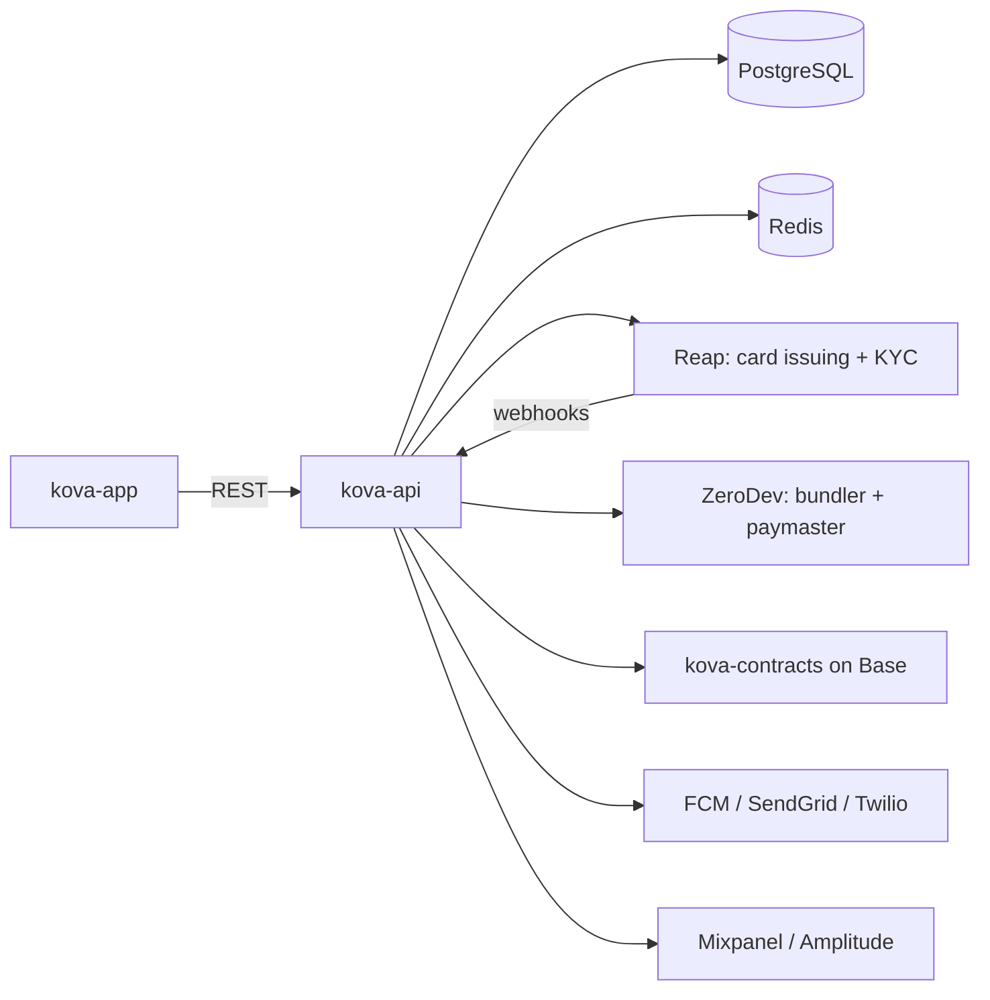
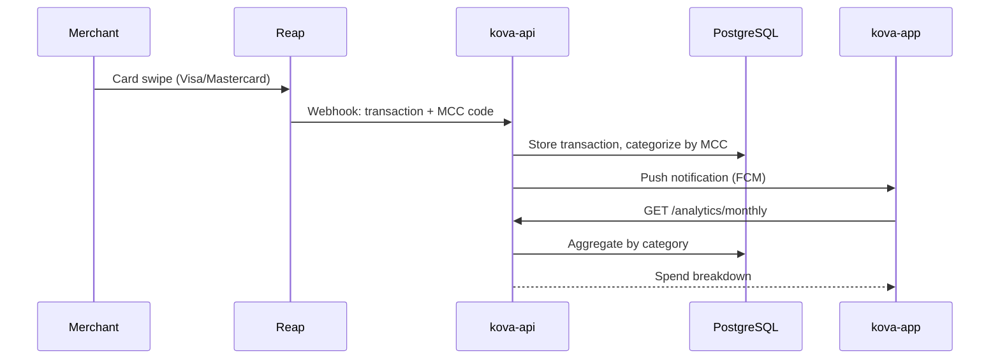
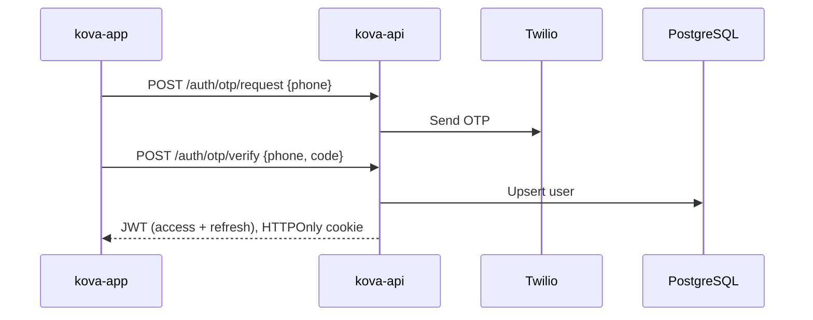
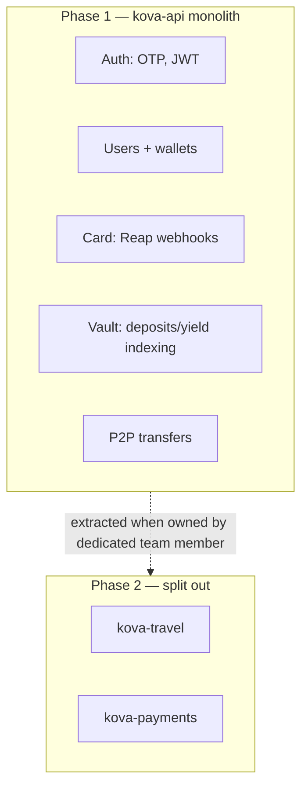
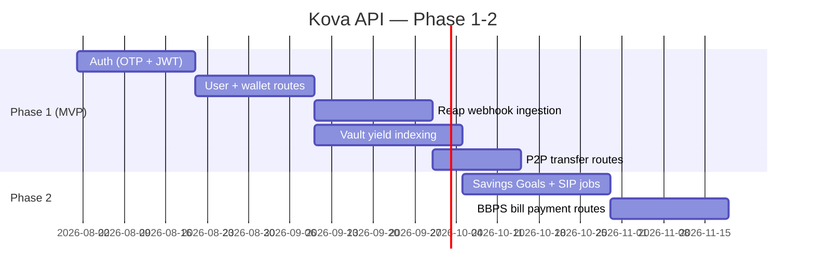

# kova-api

Backend for **Kova** — an onchain neobank on Base. Starts as a monolith per the Master Brief; splits into microservices (`kova-travel`, `kova-payments`) as the team grows.

## Where this sits



## Request flow: card transaction to spend analytics



## Auth flow (OTP + JWT)



## Service boundaries (Phase 1 monolith → Phase 2 split)



## Stack
- Node.js + TypeScript, Express
- PostgreSQL (primary) + Redis (cache, Bull queue for async jobs: SIP execution, vault rebalancing, analytics)
- Auth: JWT + refresh tokens, phone/email OTP
- Reap for card issuing/KYC, ZeroDev for smart accounts
- Monitoring: Sentry + Datadog/Grafana

## Roadmap



## Getting started
```bash
cp .env.example .env
npm install
npm run dev
```

## Status
Only a `/health` route exists. Auth, wallet, card, and vault routes are next — see roadmap above.
